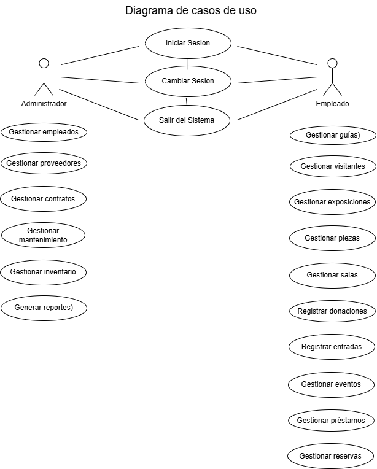

# Sistema de Gestión de Museo

## Documentación del Proyecto (Etapas del Ciclo de Vida de un Sistema)

## Índice

- Fase I: Análisis de Sistemas I
  - 1 Estudio del Problema
  - 2 Definición de Objetivos del Sistema
  - 3 Recolección de Información
  - 4 Modelo del Sistema Actual (AS-IS)
  - 5 Modelo del Sistema Propuesto (TO-BE)
  - 6 Requerimientos Funcionales y No Funcionales
    - 6.1 Requerimientos Funcionales
    - 6.2 Requerimientos No Funcionales
  - 7 Diagrama de Casos de Uso
  - 8 Diccionario de Datos

- Fase II: Diseño de Sistemas II
  - 9 Diagramas UML
    - 9.1 Diagrama de Clases
    - 9.2 Diagrama de Actividades
    - 9.3 Diagrama de Secuencia
  - 10 Diseño de Base de Datos (MER y DER)
  - 11 Prototipos de la Interfaz Gráfica
  - 12 Plan de Pruebas Funcionales
  - 13 Manual Técnico
  - 14 Manual de Usuario
   
 # Análisis de Sistemas
 

 ## 1. Estudio del Problema
Estudio del Problema Los museos pequeños y medianos suelen enfrentar procesos manuales desorganizados para gestionar sus colecciones y visitantes. En la institución estudiada (no especificado por tratarse de un caso académico) los registros de piezas, exposiciones y visitas se llevan en papel o en múltiples hojas de cálculo dispersas, sin un sistema unificado. Esto genera duplicación de datos, errores humanos y dificultades para acceder a información histórica rápidamente. Por ejemplo, se ha documentado que reportes de inventario pueden tardar días en prepararse debido a la consolidación manual de datos. La falta de digitalización también limita el análisis estadístico de la afluencia de visitantes y el mantenimiento predictivo de piezas.

Estos problemas impactan directamente en la eficiencia operativa del museo y en la conservación del patrimonio cultural. Al no existir trazabilidad electrónica (auditorías de movimiento de piezas, historial de visitas, etc.), la administración carece de mecanismos para garantizar la seguridad y transparencia de los procesos internos. En síntesis, el problema radica en la ineficiencia y riesgo derivados de la gestión manual de la información museística, lo que motiva la necesidad de un sistema de software que centralice y automatice estas tareas.

 ## 2. Definición de Objetivos del Sistema
El objetivo principal del sistema es digitalizar y centralizar los procesos del museo para mejorar la organización y el control de la información.

Se propone desarrollar una aplicación de escritorio que permita registrar, consultar y controlar todos los datos desde un solo lugar. Esta aplicación tendrá una interfaz fácil de usar y estará organizada en diferentes capas para su correcto funcionamiento.

 ## 3. Recolección de Información
Estudio del Problema Los museos pequeños y medianos suelen enfrentar procesos manuales desorganizados para gestionar sus colecciones y visitantes. En la institución estudiada (no especificado por tratarse de un caso académico) los registros de piezas, exposiciones y visitas se llevan en papel o en múltiples hojas de cálculo dispersas, sin un sistema unificado. Esto genera duplicación de datos, errores humanos y dificultades para acceder a información histórica rápidamente. Por ejemplo, se ha documentado que reportes de inventario pueden tardar días en prepararse debido a la consolidación manual de datos. La falta de digitalización también limita el análisis estadístico de la afluencia de visitantes y el mantenimiento predictivo de piezas.

Estos problemas impactan directamente en la eficiencia operativa del museo y en la conservación del patrimonio cultural. Al no existir trazabilidad electrónica (auditorías de movimiento de piezas, historial de visitas, etc.), la administración carece de mecanismos para garantizar la seguridad y transparencia de los procesos internos. En síntesis, el problema radica en la ineficiencia y riesgo derivados de la gestión manual de la información museística, lo que motiva la necesidad de un sistema de software que centralice y automatice estas tareas.
A partir de esta información se establecieron los trabajos actuales, los cuales sirvieron de base para modelar los procesos del sistema propuesto y garantizar que la solución tecnológica se adaptara a las necesidades reales del museo.

 ## 4. Modelo del Sistema Actual (AS-IS)
Actualmente no existe un sistema automatizado. Todo se realiza de forma manual:

1. El recepcionista registra los visitantes en papel.  
2. Los guías actualizan archivos de Excel después de cada visita.  
3. El administrador recopila toda la información manualmente para generar reportes.  

Este proceso genera errores, pérdida de información y duplicación de datos. Por ejemplo, un mismo visitante puede ser registrado varias veces debido a la falta de control.

 ## 5. Modelo del Sistema Propuesto (TO-BE)
Se propone desarrollar una aplicación de escritorio organizada en tres capas: presentación, negocio y datos.

  ### El sistema permitirá:

1. Gestionar empleados y guías  
2. Registrar visitantes  
3. Administrar piezas y exposiciones  
4. Registrar visitas guiadas  
5. Generar reportes  

Toda la información se almacenará en una base de datos, lo que permitirá evitar duplicaciones y mejorar el acceso a los datos. Además, cada acción quedará registrada, permitiendo llevar un control y seguimiento adecuado.

 ## 6. Requerimientos Funcionales y No Funcionales

  ### 6.1 Requerimientos Funcionales
1. Registrar información completa de las piezas del museo  
2. Administrar exposiciones  
3. Relacionar piezas con exposiciones  
4. Registrar visitantes y guías  
5. Controlar los movimientos de las piezas  
6. Realizar búsquedas de información  
7. Generar reportes  
8. Registrar visitas guiadas  

  ### 6.2 Requerimientos No Funcionales
1. El sistema debe ser una aplicación de escritorio para Windows  
2. Debe ser fácil de usar  
3. La información debe almacenarse de forma segura  
4. Debe requerir usuario y contraseña  
5. Debe ser rápido en las consultas  
6. El código debe permitir mantenimiento y mejoras

## 7. Diagrama de Casos de Uso

  #### 1. Iniciar sesión  
El usuario (administrador o empleado) introduce su usuario y contraseña. El sistema verifica los datos y, si son correctos, permite entrar al sistema mostrando las opciones según el tipo de usuario.

  #### 2. Cambiar sesión  
El usuario puede cerrar su sesión actual para iniciar con otro usuario. El sistema lo lleva nuevamente a la pantalla de inicio de sesión.

  #### 3. Salir del sistema  
El usuario cierra completamente el sistema. La aplicación se detiene.

### Funciones del Administrador

  #### 4. Gestionar empleados  
El administrador puede agregar, modificar o eliminar empleados. Se registran datos como nombre, cargo, teléfono y estado.

  #### 5. Gestionar proveedores  
El administrador puede registrar nuevos proveedores, editar su información o eliminarlos del sistema.

  #### 6. Gestionar contratos  
El administrador maneja los contratos, donde puede registrar información como fechas, tipo de contrato y monto.

  #### 7. Gestionar mantenimiento  
El administrador registra y controla las actividades de mantenimiento del museo, indicando tipo, área, responsable y estado.

  #### 8. Gestionar inventario  
El administrador administra el inventario del museo, donde puede registrar piezas con su código, categoría, ubicación y valor.

  #### 9. Generar reportes  
El administrador puede generar reportes para ver información del sistema como inventario, visitantes o mantenimiento.

### Funciones del Empleado

  #### 10. Gestionar guías  
El empleado registra y actualiza la información de los guías, como nombre, idioma y contacto.

  #### 11. Gestionar visitantes  
El empleado puede registrar y consultar la información de los visitantes.

  #### 12. Gestionar exposiciones  
El empleado administra las exposiciones, incluyendo datos como nombre, fechas y sala.

  #### 13. Gestionar piezas  
El empleado registra y actualiza las piezas del museo.

  #### 14. Gestionar salas  
El empleado administra las salas del museo, como su capacidad y ubicación.

  #### 15. Registrar donaciones  
El empleado registra las donaciones hechas al museo, incluyendo información del donante.

  #### 16. Registrar entradas  
El empleado registra la venta de entradas, indicando tipo, cantidad y método de pago.

  #### 17. Gestionar eventos  
El empleado administra los eventos del museo, incluyendo fechas y detalles.

  #### 18. Gestionar préstamos  
El empleado registra los préstamos de piezas a otras instituciones.

  #### 19. Gestionar reservas  
El empleado administra las reservas de visitas, incluyendo fecha, cantidad de visita y tipo

## 8. Diccionario de Datos

### TABLA: CONTRATO
IdContrato (INT, PK): Identificador del contrato
NumeroContrato (VARCHAR): Número del contrato
NombreProveedor (VARCHAR): Nombre del proveedor
Descripcion (VARCHAR): Descripción del contrato
Tipo (VARCHAR): Tipo de contrato
MontoTotal (DECIMAL): Monto total
FechaInicio (DATE): Fecha de inicio
FechaVencimiento (DATE): Fecha de vencimiento
Estado (VARCHAR): Estado del contrato
Observaciones (VARCHAR): Comentarios adicionales

### TABLA: DONACION
IdDonacion (INT, PK): Identificador de la donación
NombreDonante (VARCHAR): Nombre del donante
EmailDonante (VARCHAR): Correo del donante
TelefonoDonante (VARCHAR): Teléfono
Tipo (VARCHAR): Tipo de donación
Descripcion (VARCHAR): Descripción
ValorEstimado (DECIMAL): Valor estimado
FechaDonacion (DATE): Fecha
Estado (VARCHAR): Estado

### TABLA: EMPLEADO
IdEmpleado (PK): Identificador
Nombre: Nombre
Apellido: Apellido
Cargo: Cargo
FechaIngreso: Fecha de ingreso
Telefono: Teléfono
Email: Correo
Estado: Estado

### TABLA: ENTRADA
IdEntrada (INT, PK): Identificador
NombreVisitante (VARCHAR): Nombre del visitante
Tipo (VARCHAR): Tipo de entrada
Precio (DECIMAL): Precio
Cantidad (INT): Cantidad
Fecha (DATE): Fecha
MetodoPago (VARCHAR): Método de pago
Observaciones (VARCHAR): Observaciones

#### TABLA: EVENTO
IdEvento (INT, PK): Identificador
Nombre (VARCHAR): Nombre
Tipo (VARCHAR): Tipo
Responsable (VARCHAR): Responsable
CapacidadMaxima (INT): Capacidad máxima
FechaInicio (DATE): Fecha de inicio
FechaFin (DATE): Fecha de fin
Estado (VARCHAR): Estado
Descripcion (VARCHAR): Descripción

#### TABLA: EXPOSICION
IdExposicion (INT, PK): Identificador
Nombre (VARCHAR): Nombre
Descripcion (VARCHAR): Descripción
FechaInicio (DATE): Fecha de inicio
FechaFin (DATE): Fecha de fin
Sala (VARCHAR): Sala
Responsable (VARCHAR): Responsable

### TABLA: GUIA
IdGuia (INT, PK): Identificador
Nombre (VARCHAR): Nombre
Apellido (VARCHAR): Apellido
Telefono (VARCHAR): Teléfono
Email (VARCHAR): Correo
Idioma (VARCHAR): Idioma
Estado (VARCHAR): Estado

### TABLA: INVENTARIO
IdInventario (INT, PK): Identificador
Nombre (VARCHAR): Nombre
CodigoInventario (VARCHAR): Código
Categoria (VARCHAR): Categoría
Epoca (VARCHAR): Época
Material (VARCHAR): Material
Ubicacion (VARCHAR): Ubicación
ValorEstimado (DECIMAL): Valor estimado
Estado (VARCHAR): Estado
FechaIngreso (DATE): Fecha de ingreso
Descripcion (VARCHAR): Descripción

### TABLA: MANTENIMIENTO
IdMantenimiento (INT, PK): Identificador
TipoMantenimiento (VARCHAR): Tipo
Descripcion (VARCHAR): Descripción
Area (VARCHAR): Área
Responsable (VARCHAR): Responsable
FechaInicio (DATE): Fecha de inicio
FechaFin (DATE): Fecha de fin
Costo (DECIMAL): Costo
Estado (VARCHAR): Estado
Observaciones (VARCHAR): Observaciones

### TABLA: PIEZA
IdPieza (INT, PK): Identificador
Nombre (VARCHAR): Nombre
Descripcion (VARCHAR): Descripción
Epoca (VARCHAR): Época
Material (VARCHAR): Material
EstadoConservacion (VARCHAR): Estado
Ubicacion (VARCHAR): Ubicación
ValorEstimado (DECIMAL): Valor

### TABLA: PRESTAMO
IdPrestamo (INT, PK): Identificador
NombrePieza (VARCHAR): Nombre de la pieza
InstitucionSolicitante (VARCHAR): Institución
Responsable (VARCHAR): Responsable
Contacto (VARCHAR): Contacto
FechaPrestamo (DATE): Fecha préstamo
FechaDevolucion (DATE): Fecha devolución
Estado (VARCHAR): Estado
Condiciones (VARCHAR): Condiciones

### TABLA: PROVEEDOR
IdProveedor (INT, PK): Identificador
RazonSocial (VARCHAR): Nombre
RNC (VARCHAR): Identificación
Contacto (VARCHAR): Contacto
Telefono (VARCHAR): Teléfono
Email (VARCHAR): Correo
Direccion (VARCHAR): Dirección
Categoria (VARCHAR): Categoría
Estado (VARCHAR): Estado
FechaRegistro (DATE): Fecha

### TABLA: REPORTE
IdReporte (INT, PK): Identificador
Titulo (VARCHAR): Título
Tipo (VARCHAR): Tipo
FechaGeneracion (DATE): Fecha
GeneradoPor (VARCHAR): Usuario
PeriodoDesde (DATE): Desde
PeriodoHasta (DATE): Hasta
Descripcion (VARCHAR): Descripción
Estado (VARCHAR): Estado

### TABLA: RESERVA
IdReserva (INT, PK): Identificador
NombreVisitante (VARCHAR): Nombre del visitante
CantidadPersonas (INT): Cantidad
FechaReserva (DATE): Fecha
Hora (DATE): Hora
Tipo (VARCHAR): Tipo
Estado (VARCHAR): Estado
Observaciones (VARCHAR): Observaciones

### TABLA: SALA
IdSala (INT, PK): Identificador
Nombre (VARCHAR): Nombre
Capacidad (INT): Capacidad
Ubicacion (VARCHAR): Ubicación
Tipo (VARCHAR): Tipo
Estado (VARCHAR): Estado
Descripcion (VARCHAR): Descripción

### TABLA: USUARIO
IdUsuario (INT, PK): Identificador
NombreUsuario (VARCHAR): Usuario
Contrasena (VARCHAR): Contraseña
NombreCompleto (VARCHAR): Nombre completo
Rol (VARCHAR): Rol
Estado (VARCHAR): Estado

### TABLA: VISITANTE
IdVisitante (INT, PK): Identificador
Nombre (VARCHAR): Nombre
Apellido (VARCHAR): Apellido
DocumentoIdentidad (VARCHAR): Documento
Edad (INT): Edad
Genero (VARCHAR): Género
Nacionalidad (VARCHAR): Nacionalidad
Email (VARCHAR): Correo

# Fase II: Diseño de Sistemas II

## 9 Diagramas UML
En esta sección se presentan los diagramas UML del sistema, los cuales ayudan a entender su estructura, funcionamiento y comportamiento antes de su implementación.

### 9.1 Diagrama de Clases

El diagrama de clases muestra cómo está organizado el sistema, incluyendo sus clases, atributos y relaciones.

Aquí se pueden ver las clases principales del sistema, junto con sus métodos y la forma en que se relacionan entre sí.

Este diagrama ayuda a entender cómo funciona el sistema y cómo están conectadas sus diferentes partes.

### 9.2 Diagrama de Actividades

El diagrama de actividades muestra el flujo de procesos del sistema.

Permite ver paso a paso cómo se realiza una operación, en este caso la reserva de un evento y la generación de una entrada.

También incluye decisiones que muestran los diferentes caminos que puede tomar el sistema dependiendo de cada situación.

### 9.3 Diagrama de Secuencia

El diagrama de secuencia muestra cómo interactúan los diferentes componentes del sistema paso a paso.

En este caso se observa cómo el usuario interactúa con la interfaz, la lógica de negocio, el acceso a datos y la base de datos para realizar una reserva y generar una entrada.

También se puede ver que el sistema está organizado en capas.

### Conclusión de los Diagramas UML 

Los diagramas UML permiten ver el sistema desde diferentes puntos de vista.

- El diagrama de clases muestra la estructura del sistema  
- El diagrama de actividades muestra el flujo de los procesos  
- El diagrama de secuencia muestra cómo interactúan los componentes  

En conjunto, estos diagramas ayudan a entender mejor cómo funciona el sistema antes de desarrollarlo.

## 10 Diseño de Base de Datos (MER y DER)

### Descripción del Diseño

La base de datos se diseñó para organizar la información del sistema de manera ordenada.

### Modelo Entidad-Relación (MER)

El modelo entidad-relación muestra de forma general cómo está organizado el sistema.

Las principales entidades del sistema son:

Usuario, Empleado, Visitante, Guía, Sala, Evento, Exposición, Entrada, Reserva, Pieza, Inventario, Préstamo y Donación.

Relaciones principales:

- Un visitante puede tener varias entradas y reservas  
- Una reserva pertenece a un evento  
- Un evento se realiza en una sala  
- Una exposición se presenta en una sala  
- Un evento está relacionado con un empleado y un guía  
- Una pieza puede estar en inventario, ser prestada o donada  

Este modelo ayuda a entender cómo se conecta toda la información dentro del sistema.

### Diagrama Entidad-Relación (DER)

El DER representa la base de datos de forma más detallada, mostrando las tablas, sus campos principales y las relaciones entre ellas.

### Tablas principales

- Usuario: IdUsuario como clave primaria  
- Empleado: IdEmpleado como clave primaria y IdUsuario como clave foránea  
- Visitante: IdVisitante como clave primaria  
- Evento: IdEvento como clave primaria, con IdSala, IdEmpleado e IdGuia como claves foráneas  
- Exposición: IdExposicion como clave primaria y IdSala como clave foránea  
- Entrada: IdEntrada como clave primaria, con IdVisitante e IdExposicion como claves foráneas  
- Reserva: IdReserva como clave primaria, con IdVisitante e IdEvento como claves foráneas  
- Pieza: IdPieza como clave primaria  
- Inventario: IdInventario como clave primaria y IdPieza como clave foránea  
- Préstamo: IdPrestamo como clave primaria y IdPieza como clave foránea  
- Donación: IdDonacion como clave primaria y IdPieza como clave foránea  

Permite ver cómo se organizan los datos en la base de datos y cómo se relacionan entre sí.

### Estructura de la Base de Datos

#### Entidades

- Usuario  
- Empleado  
- Visitante  
- Guía  
- Sala  
- Evento  
- Exposición  
- Entrada  
- Reserva  
- Pieza  
- Inventario  
- Préstamo  
- Donación  

#### Relaciones

- USUARIO → EMPLEADO (1:1)  

- VISITANTE → ENTRADA (1:N)  
- VISITANTE → RESERVA (1:N)  

- RESERVA → EVENTO (N:1)  

- EVENTO → SALA (N:1)  
- EXPOSICIÓN → SALA (N:1)  
- EVENTO → EMPLEADO (N:1)  
- EVENTO → GUÍA (N:1)  

- PIEZA → INVENTARIO (1:1)  

- PIEZA → PRÉSTAMO (1:N)  
- PIEZA → DONACIÓN (1:N)  

- ENTRADA → EXPOSICIÓN (N:1)  

### Tablas y Claves

#### Usuario
- IdUsuario (PK)

#### Empleado
- IdEmpleado (PK)  
- IdUsuario (FK)

#### Visitante
- IdVisitante (PK)

#### Guía
- IdGuia (PK)

#### Sala
- IdSala (PK)

#### Evento
- IdEvento (PK)  
- IdSala (FK)  
- IdEmpleado (FK)  
- IdGuia (FK)

#### Exposición
- IdExposicion (PK)  
- IdSala (FK)

#### Entrada
- IdEntrada (PK)  
- IdVisitante (FK)  
- IdExposicion (FK)

#### Reserva
- IdReserva (PK)  
- IdVisitante (FK)  
- IdEvento (FK)

#### Pieza
- IdPieza (PK)

#### Inventario
- IdInventario (PK)  
- IdPieza (FK)

#### Préstamo
- IdPrestamo (PK)  
- IdPieza (FK)

#### Donación
- IdDonacion (PK)  
- IdPieza (FK)

### Conclusión

El diseño permite manejar la información de forma organizada y mantener la relación entre los datos del sistema.

## 11 Prototipos de la Interfaz Gráfica

### Descripción

Los prototipos muestran las pantallas del sistema y cómo el usuario las utiliza.

A través de estos formularios se pueden realizar operaciones como registrar, editar, consultar y eliminar información dentro del sistema.

### Pantalla de Inicio de Sesión

Esta pantalla permite al usuario ingresar al sistema mediante su nombre de usuario y contraseña, seleccionando el tipo de acceso (Administrador o Empleado).

### Menú Principal del Sistema

En esta pantalla se muestran todos los módulos disponibles del sistema, organizados según el tipo de usuario. Desde aquí se puede acceder a todas las funcionalidades.

### Gestión de Empleados

Este módulo permite registrar, modificar y eliminar la información de los empleados del museo.

### Gestión de Guías

Permite administrar los datos de los guías, incluyendo su información personal y estado dentro del sistema.

### Gestión de Visitantes

En este módulo se registran los visitantes del museo con sus datos personales.

### Gestión de Piezas

Permite gestionar las piezas del museo, incluyendo su descripción, material, estado y valor.

### Control de Inventario

Se encarga de llevar el control de los objetos registrados, su ubicación y estado dentro del museo.

### Gestión de Salas

Permite administrar las salas del museo, su capacidad, ubicación y estado.

### Gestión de Exposiciones

Permite registrar y organizar las exposiciones del museo, indicando fechas y salas asignadas.

### Gestión de Eventos Especiales

Este módulo permite gestionar eventos, incluyendo fechas, responsables y capacidad.

### Gestión de Reservas

Permite registrar reservas de visitantes, indicando fecha, cantidad de personas y tipo de visita.

### Venta y Control de Entradas

Permite registrar la venta de entradas, incluyendo tipo, cantidad, precio y método de pago.

### Registro de Donaciones

Permite registrar donaciones realizadas al museo, incluyendo información del donante y tipo de donación.

### Préstamos de Piezas

Permite gestionar el préstamo de piezas a otras instituciones, incluyendo fechas y condiciones.

## 12 Plan de Pruebas Funcionales

### Descripción

Este plan de pruebas se usa para comprobar que cada parte del sistema funcione correctamente.

A través de estas pruebas se revisa que las opciones como registrar, editar, eliminar y consultar información trabajen bien en cada módulo.

### Objetivo

Verificar que el sistema funcione correctamente y que los datos se manejen bien en todos los módulos.

### Módulos evaluados

- Inicio de sesión  
- Gestión de empleados  
- Gestión de guías  
- Gestión de visitantes  
- Gestión de piezas  
- Control de inventario  
- Gestión de salas  
- Gestión de exposiciones  
- Gestión de eventos  
- Gestión de reservas  
- Venta de entradas  
- Registro de donaciones  
- Préstamos de piezas  

### Casos de Prueba

#### Inicio de Sesión

- Caso 1: Ingreso correcto  
  Se escriben datos válidos y el sistema permite entrar.

- Caso 2: Ingreso incorrecto  
  Se ingresan datos incorrectos y el sistema muestra un error.

- Caso 3: Campos vacíos  
  No se llenan los campos y el sistema pide completar la información.

#### Gestión de Empleados

- Caso 1: Agregar empleado  
  Se llena el formulario y el sistema guarda la información.

- Caso 2: Modificar datos  
  Se cambian los datos y el sistema los actualiza.

- Caso 3: Eliminar registro  
  Se elimina un empleado y desaparece de la lista.

#### Gestión de Guías

- Caso 1: Agregar guía  
  Se ingresan los datos y se guarda correctamente.

- Caso 2: Editar información  
  Se modifican los datos y se actualizan.

- Caso 3: Eliminar guía  
  Se borra el registro y se elimina del sistema.

#### Gestión de Visitantes

- Caso 1: Registrar visitante  
  Se llena el formulario y se guarda correctamente.

- Caso 2: Editar visitante  
  Se cambian los datos y se actualizan.

- Caso 3: Eliminar visitante  
  Se elimina el registro correctamente.

#### Gestión de Piezas

- Caso 1: Registrar pieza  
  Se ingresa la información y se guarda correctamente.

- Caso 2: Editar pieza  
  Se modifican los datos y se actualizan.

- Caso 3: Eliminar pieza  
  Se elimina el registro correctamente.

#### Control de Inventario

- Caso 1: Agregar al inventario  
  Se registra un objeto y se guarda correctamente.

- Caso 2: Modificar registro  
  Se cambian los datos y se actualizan.

- Caso 3: Eliminar registro  
  Se elimina el objeto del sistema.

#### Gestión de Salas

- Caso 1: Registrar sala  
  Se ingresan los datos y se guarda correctamente.

- Caso 2: Editar sala  
  Se modifican los datos y se actualizan.

- Caso 3: Eliminar sala  
  Se elimina el registro correctamente.

#### Gestión de Exposiciones

- Caso 1: Crear exposición  
  Se llenan los datos y se guarda correctamente.

- Caso 2: Editar exposición  
  Se modifican los datos y se actualizan.

- Caso 3: Eliminar exposición  
  Se elimina correctamente.

#### Gestión de Eventos

- Caso 1: Crear evento  
  Se ingresan los datos y se guarda correctamente.

- Caso 2: Editar evento  
  Se modifican los datos y se actualizan.

- Caso 3: Eliminar evento  
  Se elimina correctamente.

#### Gestión de Reservas

- Caso 1: Registrar reserva  
  Se llenan los datos y se guarda correctamente.

- Caso 2: Editar reserva  
  Se modifican los datos y se actualizan.

- Caso 3: Eliminar reserva  
  Se elimina correctamente.

#### Venta de Entradas

- Caso 1: Registrar venta  
  Se ingresan los datos y se guarda correctamente.

- Caso 2: Editar venta  
  Se modifican los datos y se actualizan.

- Caso 3: Anular venta  
  Se cancela correctamente.

#### Registro de Donaciones

- Caso 1: Registrar donación  
  Se ingresan los datos y se guarda correctamente.

- Caso 2: Editar donación  
  Se modifican los datos y se actualizan.

- Caso 3: Eliminar donación  
  Se elimina correctamente.

#### Préstamos de Piezas

- Caso 1: Registrar préstamo  
  Se ingresan los datos y se guarda correctamente.

- Caso 2: Editar préstamo  
  Se modifican los datos y se actualizan.

- Caso 3: Eliminar préstamo  
  Se elimina correctamente.

  ## 13 Manual Técnico

### Introducción

Este manual técnico explica cómo está construido el sistema y cómo funciona, incluyendo sus componentes, organización y manejo de datos.

Está dirigido a personas con conocimientos básicos de programación.

### Objetivo

Explicar cómo está construido el sistema, mostrando sus módulos, clases y relaciones, para facilitar su comprensión y mantenimiento.

### Arquitectura del Sistema

El sistema está desarrollado utilizando programación orientada a objetos, donde cada entidad se representa mediante una clase.

El diseño se basa en:

- Clases que representan las entidades  
- Propiedades que representan los atributos  
- Identificadores únicos (PK)  
- Relaciones entre entidades mediante claves foráneas (FK)  

### Módulos del Sistema

El sistema se divide en los siguientes módulos:

- Gestión de Usuarios  
- Gestión de Visitantes  
- Gestión de Empleados  
- Gestión de Guías  
- Gestión de Salas  
- Gestión de Exposiciones  
- Gestión de Eventos  
- Gestión de Entradas  
- Gestión de Reservas  
- Gestión de Piezas  
- Gestión de Inventario  
- Gestión de Préstamos  
- Gestión de Donaciones  

Cada módulo corresponde a una clase dentro del sistema.

### Clases del Sistema

Las principales clases utilizadas son:

- Usuario  
- Visitante  
- Empleado  
- Guía  
- Sala  
- Exposición  
- Evento  
- Entrada  
- Reserva  
- Pieza  
- Inventario  
- Préstamo  
- Donación  

### Relaciones entre Clases

Las relaciones se establecen mediante claves foráneas (FK), lo que permite conectar las entidades del sistema.

Relaciones principales:

- Visitante → Entrada  
- Visitante → Reserva  
- Entrada → Exposición  
- Reserva → Evento  
- Evento → Sala  
- Evento → Empleado  
- Evento → Guía  
- Exposición → Sala  
- Pieza → Inventario  
- Pieza → Préstamo  
- Pieza → Donación  
- Usuario → Empleado  

Estas relaciones ayudan a evitar datos duplicados y mantener el sistema organizado.

### Base de Datos

El sistema utiliza identificadores únicos (ID) para cada entidad.

Características:

- Cada entidad tiene una clave primaria (PK)  
- Las relaciones se manejan con claves foráneas (FK)  
- Se evita la duplicación de información  
- Se mantiene la integridad de los datos  

### Funcionamiento General

El sistema se usa para:

- Registrar información en los módulos  
- Guardar los datos de forma organizada  
- Relacionar la información entre entidades  
- Consultar los datos registrados  

### Consideraciones Técnicas

- Se utilizan identificadores únicos para cada registro  
- Se evita repetir información en diferentes entidades  
- Las relaciones permiten conectar correctamente los datos  

El sistema está diseñado de forma simple para facilitar su uso.

### Conclusión

El sistema está organizado utilizando clases y relaciones básicas, lo que permite manejar la información del museo de forma clara y coherente.

## 14 Manual de Usuario

### Introducción

El sistema de gestión de museo permite registrar y administrar información relacionada con visitantes, empleados, guías, salas, exposiciones, eventos, piezas, inventario, préstamos, donaciones, proveedores, contratos, mantenimiento y reportes.

Esto ayuda a llevar un mejor control y organización de los datos del museo.

### Objetivo

Permitir al usuario realizar operaciones básicas como registrar, consultar y manejar la información del sistema de forma sencilla.

### Módulos del Sistema

El sistema cuenta con los siguientes módulos:

- Usuarios: Permite gestionar los accesos al sistema, incluyendo registro de usuarios, roles y estado.  

- Visitantes: Permite registrar y consultar información de los visitantes del museo.  

- Empleados: Maneja la información del personal del museo.  

- Guías: Permite registrar los guías disponibles y sus datos.  

- Salas: Administra las salas donde se realizan exposiciones y eventos.  

- Exposiciones: Permite registrar exposiciones y asignarlas a una sala.  

- Eventos: Gestiona los eventos, asignando empleados, guías y salas.  

- Entradas: Permite registrar la compra de entradas vinculadas a una exposición.  

- Reservas: Permite registrar reservas de visitantes para eventos.  

- Piezas: Administra las piezas del museo.  

- Inventario: Controla la ubicación y estado de las piezas.  

- Préstamos: Gestiona préstamos de piezas a otras instituciones.  

- Donaciones: Registra donaciones realizadas por visitantes.  

- Proveedores: Permite gestionar los proveedores del sistema.  

- Contratos: Permite registrar y administrar contratos asociados a proveedores.  

- Mantenimiento: Permite registrar y controlar las actividades de mantenimiento del museo.  

- Reportes: Permite generar reportes del sistema para consulta y análisis.  

### Salir del Sistema

El sistema incluye una opción para cerrar la aplicación de forma segura.

Para salir del sistema:

- Ubicar el botón “Salir” o “Cerrar” en el menú principal  
- Hacer clic en esa opción  
- El sistema se cerrará correctamente  

### Nota

El sistema permite gestionar de forma completa la información del museo, facilitando el registro, control y consulta de los datos de manera clara y organizada.
