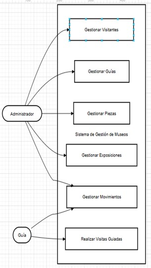

# Sistema de Gestión de Museo

## Contenido

## Documentación del Proyecto (Etapas del Ciclo de Vida de un Sistema)
#  Análisis de Sistemas  
  1. Estudio del Problema  
  2. Definición de Objetivos del Sistema  
  3. Recolección de Información  
  4. Modelo del Sistema Actual (AS-IS)  
  5. Modelo del Sistema Propuesto (TO-BE)  
  6. Requerimientos Funcionales y No Funcionales  
     6.1 Requerimientos Funcionales  
     6.2 Requerimientos No Funcionales
  7. Diagrama de Casos de Uso  
  8. Diccionario de Datos  
     TABLA: VISITANTE  
     TABLA: EMPLEADO  
     TABLA: PIEZA  
     TABLA: EXPOSICION  
     TABLA: VISITA  
     TABLA: MOVIMIENTO_PIEZA
   
 # Análisis de Sistemas

 ## 1. Estudio del Problema
Estudio del Problema Los museos pequeños y medianos suelen enfrentar procesos manuales desorganizados para gestionar sus colecciones y visitantes. En la institución estudiada (no especificado por tratarse de un caso académico) los registros de piezas, exposiciones y visitas se llevan en papel o en múltiples hojas de cálculo dispersas, sin un sistema unificado. Esto genera duplicación de datos, errores humanos y dificultades para acceder a información histórica rápidamente. Por ejemplo, se ha documentado que reportes de inventario pueden tardar días en prepararse debido a la consolidación manual de datos. La falta de digitalización también limita el análisis estadístico de la afluencia de visitantes y el mantenimiento predictivo de piezas.

Estos problemas impactan directamente en la eficiencia operativa del museo y en la conservación del patrimonio cultural. Al no existir trazabilidad electrónica (auditorías de movimiento de piezas, historial de visitas, etc.), la administración carece de mecanismos para garantizar la seguridad y transparencia de los procesos internos. En síntesis, el problema radica en la ineficiencia y riesgo derivados de la gestión manual de la información museística, lo que motiva la necesidad de un sistema de software que centralice y automatice estas tareas.

 ## 2. Definición de Objetivos del Sistema
El objetivo principal del sistema es digitalizar y centralizar los procesos del museo para mejorar la organización y el control de la información.

Se propone desarrollar una aplicación de escritorio que permita registrar, consultar y controlar todos los datos desde un solo lugar. Esta aplicación tendrá una interfaz fácil de usar y estará organizada en diferentes capas para su correcto funcionamiento.

 ## 3. Recolección de Información
Estudio del Problema Los museos pequeños y medianos suelen enfrentar procesos manuales desorganizados para gestionar sus colecciones y visitantes. En la institución estudiada (no especificado por tratarse de un caso académico) los registros de piezas, exposiciones y visitas se llevan en papel o en múltiples hojas de cálculo dispersas, sin un sistema unificado. Esto genera duplicación de datos, errores humanos y dificultades para acceder a información histórica rápidamente. Por ejemplo, se ha documentado que reportes de inventario pueden tardar días en prepararse debido a la consolidación manual de datos. La falta de digitalización también limita el análisis estadístico de la afluencia de visitantes y el mantenimiento predictivo de piezas.

Estos problemas impactan directamente en la eficiencia operativa del museo y en la conservación del patrimonio cultural. Al no existir trazabilidad electrónica (auditorías de movimiento de piezas, historial de visitas, etc.), la administración carece de mecanismos para garantizar la seguridad y transparencia de los procesos internos. En síntesis, el problema radica en la ineficiencia y riesgo derivados de la gestión manual de la información museística, lo que motiva la necesidad de un sistema de software que centralice y automatice estas tareas.
A partir de esta información se establecieron los trabajos actuales, los cuales sirvieron de base para modelar los procesos del sistema propuesto y garantizar que la solución tecnológica se adaptara a las necesidades reales del museo.

 ## 4. Modelo del Sistema Actual (AS-IS)
Actualmente no existe un sistema automatizado. Todo se realiza de forma manual:

1. El recepcionista registra los visitantes en papel.  
2. Los guías actualizan archivos de Excel después de cada visita.  
3. El administrador recopila toda la información manualmente para generar reportes.  

Este proceso genera errores, pérdida de información y duplicación de datos. Por ejemplo, un mismo visitante puede ser registrado varias veces debido a la falta de control.

 ## 5. Modelo del Sistema Propuesto (TO-BE)
Se propone desarrollar una aplicación de escritorio organizada en tres capas: presentación, negocio y datos.

  ### El sistema permitirá:

1. Gestionar empleados y guías  
2. Registrar visitantes  
3. Administrar piezas y exposiciones  
4. Registrar visitas guiadas  
5. Generar reportes  

Toda la información se almacenará en una base de datos, lo que permitirá evitar duplicaciones y mejorar el acceso a los datos. Además, cada acción quedará registrada, permitiendo llevar un control y seguimiento adecuado.

 ## 6. Requerimientos Funcionales y No Funcionales

  ### 6.1 Requerimientos Funcionales
1. Registrar información completa de las piezas del museo  
2. Administrar exposiciones  
3. Relacionar piezas con exposiciones  
4. Registrar visitantes y guías  
5. Controlar los movimientos de las piezas  
6. Realizar búsquedas de información  
7. Generar reportes  
8. Registrar visitas guiadas  

  ### 6.2 Requerimientos No Funcionales
1. El sistema debe ser una aplicación de escritorio para Windows  
2. Debe ser fácil de usar  
3. La información debe almacenarse de forma segura  
4. Debe requerir usuario y contraseña  
5. Debe ser rápido en las consultas  
6. El código debe permitir mantenimiento y mejoras

## 7. Diagrama de Casos de Uso

  #### 1.	Iniciar sesión:
  El usuario (administrador o recepcionista/guía) ingresa su nombre de usuario y contraseña. El sistema valida las           credenciales. Si son correctas, se accede a las funciones disponibles según el rol del usuario.
  #### 2.	Gestionar Empleados y Guías: 
  El administrador crea, edita o elimina registros de empleados y guías (datos personales, especialidad, turno,              etc.), asegurando que solo él pueda modificar esta información.
  #### 3.	Gestionar Piezas:
  El administrador registra nuevas piezas del museo o actualiza la información de piezas existentes (código de               inventario, descripción, autor, estado, etc.). Este caso permite mantener el inventario digital actualizado.
  #### 4.	Registrar Movimiento de Piezas: 
  El administrador ingresa cada traslado o cambio de ubicación de una pieza (fecha, origen, destino, motivo). El             sistema guarda estos datos para auditoría interna, facilitando el seguimiento del recorrido histórico de cada              pieza.
  #### 5.	Registrar Visita Guiada: 
  El recepcionista/guía programa o registra una visita grupal. Introduce la fecha de la visita, la cantidad de               asistentes, el guía asignado y la exposición correspondiente. El sistema guarda el registro y asocia al visitante          (o grupo) con la visita planeada.

## 8. Diccionario de Datos

### TABLA: VISITANTE
Información de los visitantes del museo.

| Campo | Tipo | Tamaño | Clave | Descripción |
|:---|:---|:---:|:---:|:---|
| **IdVisitante** | INT |   | PK | Identificador único autoincremental. |
| **Nombre** | VARCHAR | 100 |   | Nombre del visitante. |
| **Apellido** | VARCHAR | 100 |   | Apellido del visitante. |
| **DocumentoIdentidad** | VARCHAR | 20 |   | Cédula o pasaporte. |
| **Edad** | INT |   |   | Edad actual. |
| **Genero** | VARCHAR | 20 |   | Sexo del visitante (M/F). |
| **Nacionalidad** | VARCHAR | 50 |   | País de procedencia. |
| **Email** | VARCHAR | 100 |   | Correo electrónico (opcional). |

### TABLA: EMPLEADO
Información del personal administrativo y guías del museo.

| Campo | Tipo de Dato | Tamaño | Clave | Descripción |
|:--- |:--- |:---:|:---:|:--- |
| **IdEmpleado** | INT |   | PK | Identificador único del empleado. |
| **Nombre** | VARCHAR | 100 |   | Nombre del trabajador. |
| **Apellido** | VARCHAR | 100 |   | Apellido del trabajador. |
| **Cargo** | VARCHAR | 50 |   | Rol desempeñado (Guía, Recepcionista, etc.). |
| **Especialidad** | VARCHAR | 100 |   | Especialización (Arte, Historia, etc.). |
| **Turno** | VARCHAR | 20 |   | Horario de trabajo asignado. |
| **Usuario** | VARCHAR | 50 |   | Nombre de usuario para el inicio de sesión. |
| **Contraseña** | VARCHAR | 200 |   | Contraseña cifrada para la seguridad del acceso. |

### TABLA: PIEZA
Registro de las piezas museísticas

| Campo | Tipo de Dato | Tamaño | Clave | Descripción |
|:--- |:--- |:---:|:---:|:--- |
| **IdPieza** | INT |   | PK | Identificador único de la pieza museística. |
| **Nombre** | VARCHAR | 150 |   | Nombre o título de la obra/objeto. |
| **Tipo** | VARCHAR | 50 |   | Categoría (Pintura, Escultura, Arqueología, etc.). |
| **Autor** | VARCHAR | 100 |   | Nombre del creador o cultura de origen. |
| **Material** | VARCHAR | 100 |   | Composicion fisica (Marmol, Bronce, Piedra, Hierro, Otros metales). |
| **Año** | INT |   |   | Año de creación o periodo histórico. |
| **Estado** | VARCHAR | 100 |   | Condición física (Excelente, Restauración, Dañado). |
| **Ubicacion** | VARCHAR | 100 |   | Sala o depósito donde se encuentra actualmente. |

### TABLA: EXPOSICION
Registro de exposiciones organizadas por el museo.

| Campo | Tipo de Dato | Tamaño | Clave | Descripción |
|:--- |:--- |:---:|:---:|:--- |
| **IdExposicion** | INT |   | PK | Identificador único de la exposición. |
| **Nombre** | VARCHAR | 100 |   | Título de la muestra o evento. |
| **Tipo** | VARCHAR | 50 |   | Naturaleza del evento (Temporal, Permanente, Itinerante). |
| **FechaInicio** | DATE |   |   | Fecha de apertura al público. |
| **FechaFin** | DATE |   |   | Fecha de clausura programada. |
| **Sala** | VARCHAR | 100 |   | Sala, pabellón o área asignada dentro del museo. |

#### TABLA: VISITA
Registro de los recorridos guiados, vinculando a los grupos de visitantes con el personal (guías) y las muestras culturales específicas.

| Campo | Tipo de Dato | Tamaño | Clave | Descripción |
|:--- |:--- |:---:|:---:|:--- |
| **IdVisita** | INT |   | PK | Identificador único del registro de visita. |
| **Fecha** | DATE |   |   | Fecha en la que se realiza el recorrido. |
| **CantidadPersonas** | INT |   |   | Número total de asistentes en el grupo. |
| **IdGuia** | INT |   | FK | Referencia al empleado asignado como guía. |
| **IdExposicion** | INT |   | FK | Referencia a la exposición que se está visitando. |

#### TABLA: MOVIMIENTO_PIEZA
DetallE de los traslados físicos de las piezas, permitiendo rastrear el origen, destino y tipo de movimiento (interno o externo).

| Campo | Tipo de Dato | Tamaño | Clave | Descripción |
|:--- |:--- |:---:|:---:|:--- |
| **IdMovimiento** | INT |   | PK | Identificador único del registro de movimiento. |
| **IdPieza** | INT |   | FK | Referencia a la pieza que ha sido trasladada. |
| **FechaMovimiento** | DATE |   |   | Fecha exacta en la que se realizó el traslado. |
| **TipoMovimiento** | VARCHAR | 50 |   | Naturaleza del traslado (Interno, Externo, Préstamo). |
| **Origen** | VARCHAR | 100 |   | Ubicación inicial (Ej: Sala 1, Depósito A). |
| **Destino** | VARCHAR | 100 |   | Nueva ubicación asignada a la pieza. |

### TABLA: USUARIO
Gestiona las credenciales y niveles de acceso al sistema del museo.

| Campo | Tipo | Tamaño | Clave | Descripción |
| :--- | :--- | :--- | :--- | :--- |
| **IdUsuario** | INT |   | PK | Identificador único del registro de usuario (Autoincremental). |
| **NombreUsuario** | VARCHAR | 50 |   | Alias o login único para el acceso al sistema. |
| **Contrasena** | VARCHAR | 255 |   | Clave de acceso (validada en la Capa de Datos). |
| **NombreCompleto** | VARCHAR | 200 |   | Nombre real del empleado o administrador. |
| **Rol** | VARCHAR | 50 |   | Perfil de permisos (Ej: Administrador, Recepción, Guía). |
| **Estado** | VARCHAR | 20 |   | Filtro de acceso (Solo usuarios 'Activo' pueden loguearse). |

